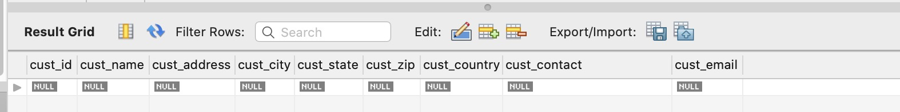
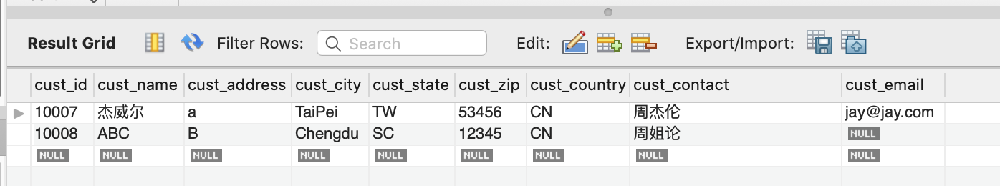

# MySQL库函数

注意：函数没有SQL的可移植性强，大多数函数可能是MySQL独有的，或者名称不一样。

函数大多数按照如下分类。

* 用于处理文本串(如删除或填充值，转换值为大写或小写)的文本函数。
* 用于在数值数据上进行算术操作(如返回绝对值，进行代数运算)的数值函数。
* 用于处理日期和时间值并从这些值中提取特定成分(例如，返回两个日期之差，检查日期有效性等)的日期和时间函数。
* 返回DBMS正使用的特殊信息(如返回用户登录信息，检查版本细节)的系统函数。

### 文本处理函数

| 函数        | 说明              |
| ----------- | ----------------- |
| Left()      | 返回串左边的字符  |
| Length()    | 返回串的长度      |
| Locate()    | 找出串的一个子串  |
| Lower()     | 将串转换为小写    |
| LTrim()     | 去掉串左边的空格  |
| Right()     | 返回串右边的字符  |
| RTrim()     | 去掉串右边的空格  |
| Soundex()   | 返回串的SOUNDEX值 |
| SubString() | 返回子串的字符    |
| Upper()     | 将串转换为大写    |


### Soundex 函数（按音节查询）

SOUNDEX是一个将任何文 本串转换为描述其语音表示的字母数字模式的算法。SOUNDEX考虑了类似的发音字符和音节，使得能对串进行发音比较而不是字母比较。虽然 SOUNDEX不是SQL概念，但MySQL(就像多数DBMS一样)都提供对SOUNDEX的支持。

下面给出一个使用Soundex()函数的例子。customers表中有一个顾客杰威尔公司，其联系名为周杰伦。但如果这是输入错误，成了周杰轮，怎么办?显然，按正确的联系名搜索不会返回数据，如下所示:

```sql
SELECT * FROM cc.customers where cust_contact='周杰轮';
```



现在试一下使用Soundex()函数进行搜索，它匹配所有发音类似于 周杰伦的联系名:

```sql
SELECT * FROM cc.customers where Soundex(cust_contact)=Soundex('周接仑');
```




### Concat函数（拼接字符串）

拼接(concatenate) 将值联结到一起构成单个值。
```sql
SELECT CONCAT(字符串1或者列名,'字符串2')  FROM 表名;
```


例：把供应商名字和供应商国家连起来
```sql
SELECT CONCAT(vend_name ,' (',vend_country,')')  FROM cc.vendors;
```


### Trim 函数（去除空格）

```sql
SELECT TRIM(列名) FROM 表名;
---- 去除左边空格
SELECT LTRIM(列名) FROM 表名;
---- 去除右边空格
SELECT RTRIM(列名) FROM 表名;
```


### AS操作符（别名）

```sql
SELECT 列名 AS 别名 FROM 表名;
```


### 算术操作符

| 操作符 | 说明 |
| ------ | ---- |
| +      | 加   |
| -      | 减   |
| *      | 乘   |
| /      | 除   |

```sql
SELECT 列名1 + 列名2或常量 FROM 表名;
```


### 日期和时间处理函数

日期和时间采用相应的数据类型和特殊的格式存储，以便能快速和有效地排序或过滤，并且节省物理存储空间。


| 函数          | 说明                           |
| ------------- | ------------------------------ |
| AddDate()     | 增加一个日期(天、周等)         |
| AddTime()     | 增加一个时间(时、分等)         |
| CurDate()     | 返回当前日期                   |
| CurTime()     | 返回当前时间                   |
| Date()        | 返回日期时间的日期部分         |
| DateDiff()    | 计算两个日期之差               |
| Date_Add()    | 高度灵活的日期运算函数         |
| Date_Format() | 返回一个格式化的日期或时间串   |
| Day()         | 返回一个日期的天数部分         |
| DayOfWeek()   | 对于一个日期，返回对应的星期几 |
| Hour()        | 返回一个时间的小时部分         |
| Minute()      | 返回一个时间的分钟部分         |
| Month()       | 返回一个日期的月份部分         |
| Now()         | 返回当前日期和时间             |
| Second()      | 返回一个时间的秒部分           |
| Time()        | 返回一个日期时间的时间部分     |
| Year()        | 返回一个日期的年份部分         |


### 数值处理函数

| 函数   | 说明               |
| ------ | ------------------ |
| Abs()  | 返回一个数的绝对值 |
| Cos()  | 返回一个角度的余弦 |
| Exp()  | 返回一个数的指数值 |
| Mod()  | 返回除操作的余数   |
| Pi()   | 返回圆周率         |
| Rand() | 返回一个随机数     |
| Sin()  | 返回一个角度的正弦 |
| Sqrt() | 返回一个数的平方根 |
| Tan()  | 返回一个角度的正切 |


### 聚集函数

我们经常需要汇总数据而不用把它们实际检索出来，为此MySQL提供了专门的函数。使用这些函数，MySQL查询可用于检索数据，以便分 析和报表生成。这种类型的检索例子有以下几种。

* 确定表中行数(或者满足某个条件或包含某个特定值的行数)。 
* 􏰀获得表中行组的和。
* 找出表列(或所有行或某些特定的行)的最大值、最小值和平均值。

**聚集函数(aggregate function)** 运行在行组上，计算和返回单个值的函数。


| 函数    | 说明             |
| ------- | ---------------- |
| AVG()   | 返回某列的平均值 |
| COUNT() | 返回某列的行数   |
| MAX()   | 返回某列的最大值 |
| MIN()   | 返回某列的最小值 |
| SUM()   | 返回某列值之和   |


### 平均数函数（AVG）

AVG函数，通过对表中行数计数并计算特定列值之和，求得该列的平均值。
**NULL值**  AVG()函数忽略列值为NULL的行。
```sql
SELECT AVG(列名) FROM 表名;
```


### 计数函数（COUNT）
COUNT()函数进行计数。可利用COUNT()确定表中行的数目或符合特定条件的行的数目。

COUNT()函数有两种使用方式。

* 使用COUNT(*)对表中行的数目进行计数，不管表列中包含的是空值(NULL)还是非空值。

  返回所有行

```sql
SELECT COUNT(*) FROM 表名;
```

* 使用COUNT(column)对特定列中具有值的行进行计数，忽略 NULL值。

  返回所有非空行
```sql
SELECT COUNT(列名) FROM 表名;
```

  

### 最大值函数（MAX）

返回列的最大值

```sql
SELECT MAX(列名) FROM 表名;
```


### 最小值函数（MIN）

返回列的最小值

```sql
SELECT MIN(列名) FROM 表名;
```


### 求和函数（SUM）

返回列的总和

```sql
SELECT SUM(列名) FROM 表名;
```


### 排除重复值

以上5个聚集函数都可以如下使用:􏰀 

* 对所有的行执行计算，指定ALL参数或不给参数(因为ALL是默认行为);
* 只包含不同的值，指定DISTINCT参数。

**ALL为默**认 ALL参数不需要指定，因为它是默认行为。如果 不指定DISTINCT，则假定为ALL。

```sql
SELECT AVG(DISTINCT 列名) FROM 表名;
```

**注意：** 如果指定列名，则DISTINCT只能用于COUNT()。DISTINCT 不能用于COUNT(*)，因此不允许使用COUNT(DISTINCT)， 否则会产生错误。类似地，DISTINCT必须使用列名，不能用于计算或表达式。

**将DISTINCT用于MIN()和MAX()** 虽然DISTINCT从技术上可用于MIN()和MAX()，但这样做实际上没有价值。一个列中的最小值和最大值不管是否包含不同值都是相同的。