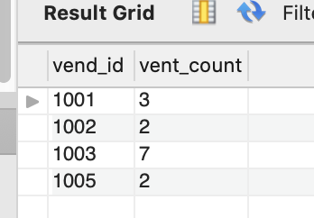
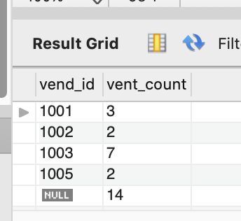
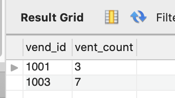
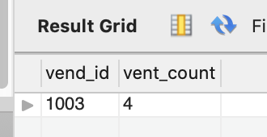

# 分组查询（GROUP BY语句）

### 分组查询

在具体使用GROUP BY子句前，需要知道一些重要的规定。

* GROUP BY子句可以包含任意数目的列。这使得能对分组进行嵌套， 为数据分组提供更细致的控制。

* 如果在GROUP BY子句中嵌套了分组，数据将在最后规定的分组上 进行汇总。换句话说，在建立分组时，指定的所有列都一起计算(所以不能从个别的列取回数据)。
* GROUP BY子句中列出的每个列都必须是检索列或有效的表达式(但不能是聚集函数)。如果在SELECT中使用表达式，则必须在 GROUP BY子句中指定相同的表达式。不能使用别名。
* 除聚集计算语句外，SELECT语句中的每个列都必须在GROUP BY子 句中给出。
* 如果分组列中具有NULL值，则NULL将作为一个分组返回。如果列中有多行NULL值，它们将分为一组。
* GROUP BY子句必须出现在WHERE子句之后，ORDER BY子句之前。


例：统计每个供应商的产品数量

```sql
SELECT vend_id,COUNT(prod_name) AS vent_prod_count FROM products GROUP BY vend_id;
```



### WITH ROLLUP 

**使用ROLLUP** 使用WITH ROLLUP关键字，可以得到每个分组以及每个分组汇总级别(针对每个分组)的值

例：统计每个供应商的产品，并在最后一行返回一共有多少产品。
```sql
SELECT vend_id,COUNT(prod_name) AS vent_prod_count FROM products GROUP BY vend_id WITH ROLLUP;
```



### 过滤分组

过滤分组不能用WHERE 子句，得用HAVING 操作符。**HAVING 可以和 WHERE 连用**

**HAVING支持所有WHERE操作**，本笔记有关WHERE的所有这些技术和选项都适用于 HAVING。它们的句法是相同的，只是关键字有差别。

**HAVING和WHERE的差别**，WHERE在<u>数据分组前进行过滤</u>，HAVING<u>在数据分组后进行过滤</u>。这是一个重要的区别，<u>WHERE排除的行不包括在分组中</u>。这可能会改变计算值，从而影响HAVING子句中基于这些值过滤掉的分组。

例：统计 产品数量大于2的供应商
```sql
SELECT vend_id,COUNT(prod_name) AS vent_prod_count FROM products GROUP BY vend_id HAVING COUNT(prod_name)>2;
```



例：统计 产品价格大于等于10，数量大于2的供应商

```sql
SELECT vend_id,COUNT(prod_name) AS vent_prod_count 
FROM products 
WHERE prod_price>=10
GROUP BY vend_id HAVING COUNT(prod_name)>2;
```




### 分组和排序(ORDERBY与GROUPBY)区别


| ORDER BY                                   | GROUP BY                                                 |
| ------------------------------------------ | -------------------------------------------------------- |
| 排序产生的输出                             | 分组行。但输出可能不是分组的顺序                         |
| 任意列都可以使用(甚至非选择的列也可以使用) | 只可能使用选择列或表达式列，而且必须使用每个选择列表达式 |
| 不一定需要                                 | 如果与聚集函数一起使用列(或表达式)，则必须使用           |


### SELECT子句顺序

| 关键词   | 说明               | 是否必须使用           |
| -------- | ------------------ | ---------------------- |
| SELECT   | 要返回的列或表达式 | 是                     |
| FROM     | 从中检索数据的表   | 仅在从表选择数据时使用 |
| WHERE    | 行级过滤           | 否                     |
| GROUP BY | 分组说明           | 仅在按组计算聚集时使用 |
| HAVING   | 组级过滤           | 否                     |
| ORDER BY | 输出排序顺序       | 否                     |
| LIMIT    | 要检索的行数       | 否                     |

