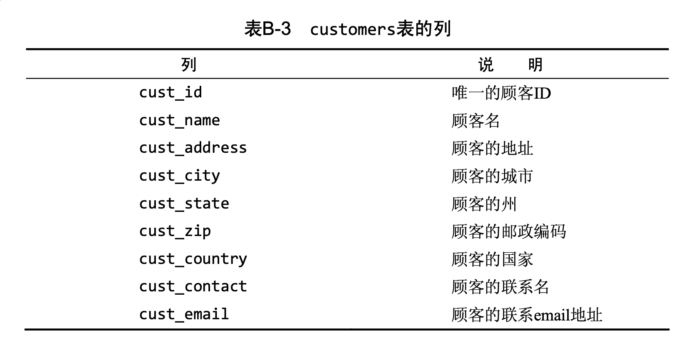
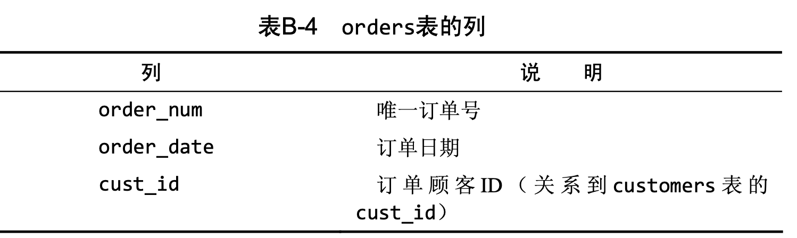
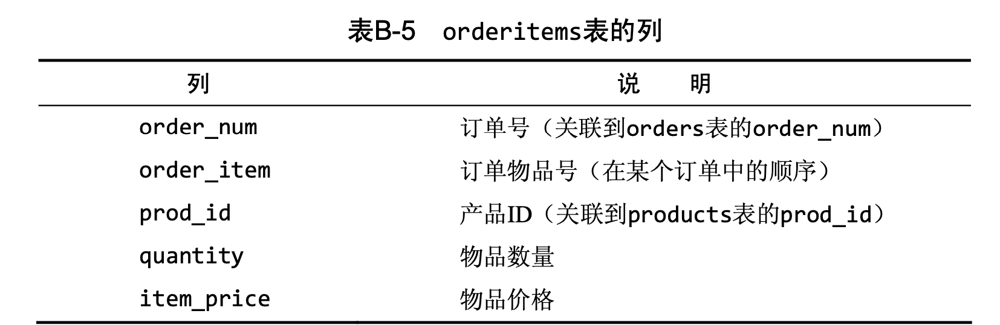

# 子查询(IN)

**子查询(subquery)，**即嵌套在其他查询中的查询。


本文采用了书中的数据库来介绍。









订单存储在两个表中。对于包含订单号、客户ID、 订单日期的每个订单，orders表存储一行。各订单的物品存储在相关的 orderitems表中。orders表不存储客户信息。它只存储客户的ID。实际的客户信息存储在customers表中。

### 用子查询进行过滤

现在，假如需要列出订购物品TNT2的所有客户，应该怎样检索?下面列出具体的步骤。

1. 检索包含物品TNT2的所有订单的编号。

   ```sql
   SELECT order_num FROM orderitems WHERE prod_id ='TNT2';
   ```

2. 检索具有前一步骤列出的订单编号的所有客户的ID。
   ```sql
   SELECT cust_id FROM orders WHERE order_num IN  (20005,20007);
   ```
3. 检索前一步骤返回的所有客户ID的客户信息
   ```sql
   SELECT * FROM customers WHERE cust_id IN  (10001,10004);
	```

上述每个步骤都可以单独作为一个查询来执行。可以把一条SELECT 语句返回的结果用于另一条SELECT语句的WHERE子句。也可以使用子查询来把3个查询组合成一条语句。

**子查询语法**

```sql
SELECT * FROM 表名1 WHERE 列名1 IN (SELECT 列名2 FROM 表名2)
```

```sql
SELECT * 
FROM customers 
WHERE cust_id IN  (
	SELECT cust_id FROM orders WHERE order_num IN  
    (SELECT order_num FROM orderitems WHERE prod_id ='TNT2')
);
```


### 作为计算字段使用子查询

使用子查询的另一方法是创建计算字段。

假如需要显示customers表中每个客户的订单总数。订单与相应的客户ID存储在orders表中。

为了执行这个操作，遵循下面的步骤。

1. 从customers表中检索客户列表。
2. 对于检索出的每个客户，统计其在orders表中的订单数目。

```sql
SELECT cust_name,cust_state,
(SELECT COUNT(*) FROM orders WHERE orders.cust_id=customers.cust_id) AS orders
FROM customers; 
```

