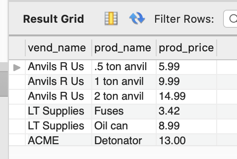
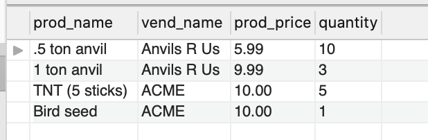
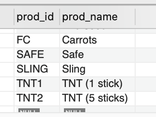
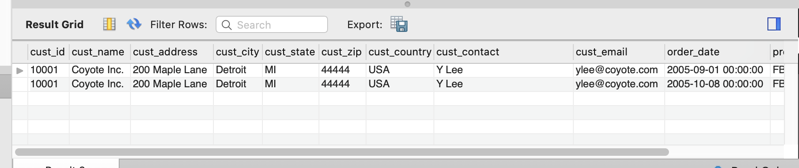
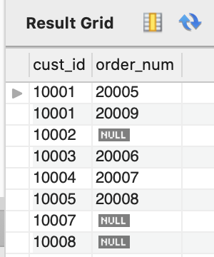
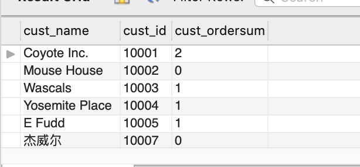

# 连接查询（JOIN）

### 内部联结（INNER JOIN）

**又名等值联结(equijoin)**

JOIN语句可以关联两张表，**但是必须带上WHERE子句**，否则返回结果是 <u>笛卡尔积</u>。由于列会出现重名的情况，所以我们需要对重名的列，使用<u>完全限定名</u>。

**笛卡儿积(cartesian product)** 由没有联结条件的表关系返回的结果为笛卡儿积。检索出的行的数目将是第一个表中的行数乘以第二个表中的行数。

**完全限定列名** 在引用的列可能出现二义性时，必须使用完全限定列名(用一个点分隔的表名和列名)。如果引用一个 没有用表名限制的具有二义性的列名，MySQL将返回错误。

**不要忘了WHERE子句** 应该保证所有联结都有WHERE子句，否则MySQL将返回比想要的数据多得多的数据。同理，应该保 证WHERE子句的正确性。不正确的过滤条件将导致MySQL返回不正确的数据。

语法

注意：列1，2都是你自己指定的列，假定 表1.列1 = 表2.列1。

```sql
SELECT 表1.列1 , 表1.列2, 表2.列2 
FROM 表1,表2
WHERE 表1.列1 = 表2.列1;
```

例：查询所有供应商及其产品详情

```sql
SELECT vend_name,prod_name,prod_price 
FROM products , vendors 
WHERE products.vend_id=vendors.vend_id;
```




内部联结，两个表之间的关系是由FROM子句的组成，以INNER JOIN指定。在使用这种语法时，联结条件用特定的ON子句而不是WHERE子句给出。传递给ON的实际条件与传递给WHERE的相同。

**使用哪种语法** ANSI SQL规范首选INNER JOIN语法。此外， 尽管使用WHERE子句定义联结的确比较简单，但是使用明确的联结语法能够确保不会忘记联结条件，有时候这样做也能影响 性能。

```sql
SELECT 表1.列1 , 表1.列2, 表2.列2 
FROM 表1 INNER JOIN 表2
ON 表1.列1 = 表2.列1;
```

例：查询所有供应商及其产品详情

```sql
SELECT vend_name,prod_name,prod_price 
FROM  vendors INNER JOIN products
ON products.vend_id=vendors.vend_id;
```
结果和等值查询的一样，此语句中的SELECT与前面的SELECT语句相同，但FROM子句不同。这里，两个表之间的关系是FROM子句的组成部分，以INNER JOIN指定。在使用这种语法时，联结条件用特定的ON子句而不是WHERE 子句给出。传递给ON的实际条件与传递给WHERE的相同。


### 联结多个表

**性能考虑** MySQL在运行时关联指定的每个表以处理联结。 这种处理可能是非常耗费资源的，因此应该仔细，不要联结 不必要的表。<u>联结的表越多，性能下降越厉害。</u>

SQL对一条SELECT语句中可以联结的表的数目没有限制。创建联结的基本规则也相同。首先列出所有表，然后定义表之间的关系。

语法

注意：列1，2，3，4都是你自己指定的列，假定 表1.列1 = 表2.列1 ，表2.列4 =表3.列4。

```sql
SELECT 表1.列1 , 表1.列2, 表2.列2, 表3.列2
FROM 表1,表2,表3
WHERE 表1.列1 = 表2.列1 AND 表2.列4 =表3.列4
```

例：查询2005订单的产品数量详情

```sql
SELECT prod_name, vend_name,prod_price,quantity
FROM  orderitems, products,vendors
WHERE products.vend_id=vendors.vend_id 
AND orderitems.prod_id=products.prod_id AND order_num=20005;
```




### 自联结

自连接，指的是一个表自己和自己连接。

下面我们来看一个例子，假如你发现某物品(其ID为DTNTR)存在问题，因此想知道生产该物 品的供应商生产的其他物品是否也存在这些问题。此查询要求首先找到 生产ID为DTNTR的物品的供应商，然后找出这个供应商生产的其他物品。

解决办法1（不推荐，子查询，效率低）

```sql
SELECT prod_id,prod_name
FROM  products
WHERE vend_id =
(SELECT vend_id FROM products WHERE prod_id ='DTNTR');
```



解决办法2（推荐，自连接）

```sql
SELECT p1.prod_id , p1.prod_name
FROM  products AS p1, products AS p2
WHERE p1.vend_id = p2.vend_id AND p2.prod_id = 'DTNTR';
```


WHERE(通过匹配p1中 的vend_id和p2中的vend_id)首先联结两个表，然后按第二个表中的 prod_id过滤数据，返回所需的数据。

### 自然联结

无论何时对表进行联结，应该至少有一个列出现在不止一个表中(被联结的列)。标准的联结返回所有数据，甚至相同的列多次出现。自然联结排除多次出现，使每个列只返回一次。自然联结是这样一种联结，其中你只能选择那些唯一的列。这一般是通过对表使用通配符(SELECT *)，对所有其他表的列使用明确的子 集来完成的。

下面举一个例子:

```sql
SELECT c.* , o.order_date,oi.prod_id,oi.quantity,oi.item_price
FROM  customers AS c , orders AS o , orderitems AS oi
WHERE c.cust_id =o.cust_id
AND oi.order_num=o.order_num
AND prod_id='FB';
```



在这个例子中，通配符只对第一个表使用。所有其他列明确列出，所以没有重复的列被检索出来。

### 外部联结

许多联结将一个表中的行与另一个表中的行相关联。但有时候会需要包含没有关联行的那些行。

**外部联结的类型** 存在两种基本的外部联结形式:左外部联结 和右外部联结。它们之间的唯一差别是所关联的表的顺序不同。换句话说，左外部联结可通过颠倒FROM或WHERE子句中表的顺序转换为右外部联结。因此，两种类型的外部联结可互 换使用，而究竟使用哪一种纯粹是根据方便而定。


例如，可能需要使用联结来完成以下工作:

* 对每个客户下了多少订单进行计数，包括那些至今尚未下订单的客户; 
* 列出所有产品以及订购数量，包括没有人订购的产品;
* 计算平均销售规模，包括那些至今尚未下订单的客户。


例如，检索所有客户，包括那些没有订单的客户

```sql
SELECT c.cust_id,o.order_num
FROM  customers AS c LEFT OUTER JOIN  orders AS o
ON c.cust_id =o.cust_id;
```




这条SELECT语句使用了关键字OUTER JOIN来指定联结的类型(而不是在WHERE子句中指定)。

但是，与内部联结关联两个表中的行不同的是，外部联结还包括没有关联行的行。

在使用OUTER JOIN语法时，必须使用RIGHT或LEFT关键字指定包括其所有行的表(RIGHT指出的是OUTER JOIN右边的表，而LEFT 指出的是OUTER JOIN左边的表)。

上面的例子使用LEFT OUTER JOIN从FROM 子句的左边表(customers表)中选择所有行。为了从右边的表中选择所 有行，应该使用RIGHT OUTER JOIN.


**外部联结的类型** 存在两种基本的外部联结形式:左外部联结 和右外部联结。它们之间的唯一差别是所关联的表的顺序不同。换句话说，左外部联结可通过颠倒FROM或WHERE子句中表的顺序转换为右外部联结。因此，两种类型的外部联结可互 换使用，而究竟使用哪一种纯粹是根据方便而定。


### 使用带聚集函数的联结

例如：如果要检索所有客户及每个客户所下的订单数

注意：这里某些客户可能没有下单，我们的需求是查询所有客户，包括哪些没有下单的客户，所以使用左联

```sql
SELECT customers.cust_name,customers.cust_id,
COUNT(orders.order_num) AS cust_ordersum
FROM customers LEFT OUTER JOIN orders
ON customers.cust_id=orders.cust_id
GROUP BY customers.cust_id;
```




### 使用联结和联结条件

* 注意所使用的联结类型。一般我们使用内部联结，但使用外部联结也是有效的。
* 保证使用正确的联结条件，否则将返回不正确的数据。 
* 应该总是提供联结条件，否则会得出笛卡儿积。 
* 在一个联结中可以包含多个表，甚至对于每个联结可以采用不同的联结类型。虽然这样做是合法的，一般也很有用，但应该在一 起测试它们前，分别测试每个联结。这将使故障排除更为简单。