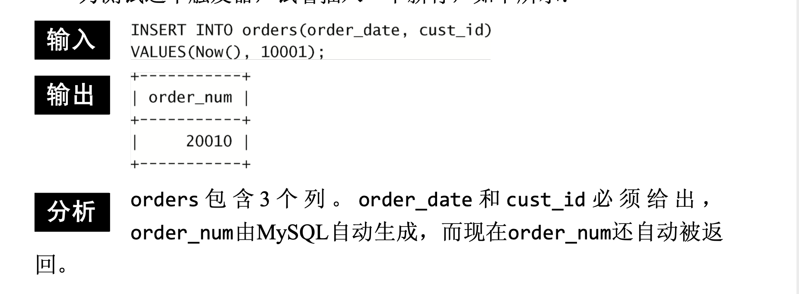

# 触发器(TRIGGER)

触发器是MySQL响应以下任意语句而自动执行的一条MySQL语句(或位于BEGIN和END语句之间的一组语句)；

* DELETE
* INSERT
* UPDATE

其他MySQL语句不支持触发器。

## 创建触发器

在创建触发器时，需要给出4条信息:

* 唯一的触发器名;
* 触发器关联的表;
* 触发器应该响应的活动(DELETE、INSERT或UPDATE); 
* 触发器何时执行(处理之前或之后)。

**保持每个数据库的触发器名唯一** 最好是在数据库范围内使用唯一的触发器名。

触发器用CREATE TRIGGER语句创建。下面是一个简单的例子:

```mysql
CREATE TRIGGER newproduct AFTER INSERT on prouducts
FOR EACH ROW SELECT 'Product added';
```

CREATE TRIGGER用来创建名为newproduct的新触发器。

触发器可在一个操作发生之前或之后执行，这里给出了AFTER INSERT， 所以此触发器将在INSERT语句成功执行后执行。

这个触发器还指定FOR EACH ROW，因此代码对每个插入行执行。

在这个例子中，文本Product added将对每个插入的行显示一次。为了测试这个触发器，使用INSERT语句添加一行或多行到products 中，你将看到对每个成功的插入，显示Product added消息。

**仅支持表** 只有表才支持触发器，视图不支持(临时表也不支持)。

**触发器按每个表每个事件每次地定义**，每个表每个事件每次只允许一个触发器。因此，每个表最多支持6个触发器(每条INSERT、UPDATE和DELETE的之前和之后)。**单一触发器不能与多个事件或多个表关联**，所以，如果你需要一个对INSERT和UPDATE操作执行的触发器，则应该定义两个触发器。

**触发器失败** 如果BEFORE触发器失败，则MySQL将不执行请求的操作。此外，如果BEFORE触发器或语句本身失败，MySQL 将不执行AFTER触发器(如果有的话)。

## 删除触发器

删除一个触发器，可使用DROP TRIGGER语句

```mysql
DROP TRIGGER newproduct;
```

触发器不能更新或覆盖。为了修改一个触发器，必须先删除它， 然后再重新创建。


## 使用触发器

### INSERT触发器

INSERT触发器在INSERT语句执行之前或之后执行。需要知道以下几点:

* 在INSERT触发器代码内，可引用一个名为NEW的虚拟表，访问被 插入的行;

* 在BEFORE INSERT触发器中，NEW中的值也可以被更新(允许更改 被插入的值);

* 对于AUTO_INCREMENT列，NEW在INSERT执行之前包含0，在INSERT 执行之后包含新的自动生成值。

下面举一个例子(一个实际有用的例子)。AUTO_INCREMENT列具有 MySQL自动赋予的值。

```mysql
CREATE TRIGGER neworder AFTER INSERT ON orders
FOR EACH ROW SELECT NEW.order_num;
```

此代码创建一个名为neworder的触发器，它按照AFTER INSERT ON orders执行。在插入一个新订单到orders表时，MySQL生成一个新订单号并保存到order_num中。触发器从NEW. order_num取得这个值并返回它。

此触发器必须按照AFTER INSERT执行，因为在BEFORE INSERT语句执行之前，新order_num还没有生成。对于orders的每次插入使用这个触发器将总是返回新的订单号。

为测试这个触发器，试着插入一下新行，如下所示:



**BEFORE或AFTER?** 通常，将BEFORE用于数据验证和净化(目的是保证插入表中的数据确实是需要的数据)。本提示也适用于UPDATE触发器。

 ### DELETE触发器

DELETE触发器在DELETE语句执行之前或之后执行。需要知道以下两点:

* 在DELETE触发器代码内，你可以引用一个名为OLD的虚拟表，访问被删除的行;
* OLD中的值全都是只读的，不能更新。

下面的例子演示使用OLD保存将要被删除的行到一个存档表中:

```mysql
CREATE TRIGGER deleteorder BEFORE DELETE ON orders
FOR EACH ROW
BEGIN
	INSERT INTO archive_orders(order_num,order_date,cust_id)
  VALUES (OLD.order_num,OLD.order_date,OLD.cust_id);
END;
```

在任意订单被删除前将执行此触发器。它使用一条INSERT语句将OLD中的值(要被删除的订单)保存到一个名为archive_ orders的存档表中(为实际使用这个例子，你需要用与orders相同的列 创建一个名为archive_orders的表)。

使用BEFORE DELETE触发器的优点(相对于AFTER DELETE触发器 来说)为，如果由于某种原因，订单不能存档，DELETE本身将被放弃。

**多语句触发器** 触发器deleteorder使用BEGIN和 END语句标记触发器体。这在此例子中并不是必需的，不过也没有害处。使用BEGIN END块的好处是触发器能容纳多条SQL语句(在BEGIN END块中一条挨着一条)。

 ### UPDATE触发器

UPDATE触发器在UPDATE语句执行之前或之后执行。需要知道以下几点:

* 在UPDATE触发器代码中，你可以引用一个名为OLD的虚拟表访问 以前(UPDATE语句前)的值，引用一个名为NEW的虚拟表访问新更新的值;
* 在BEFORE UPDATE触发器中，NEW中的值可能也被更新(允许更改将要用于UPDATE语句中的值);
* OLD中的值全都是只读的，不能更新。

下面的例子保证州名缩写总是大写(不管UPDATE语句中给出的是大写还是小写):
```mysql
CREATE TRIGGER updatevendor BEFORE UPDATE ON vendors
FOR EACH ROW SET NEW.vend_state= Upper(NEW.vend_state);
```

任何数据净化都需要在UPDATE语句之前进行，像这个例子中一样。每次更新一个行时，NEW.vend_state中的值(将用来更新表行的值)都用Upper(NEW.vend_state)替换。

