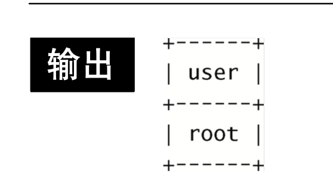
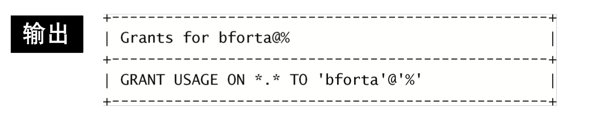
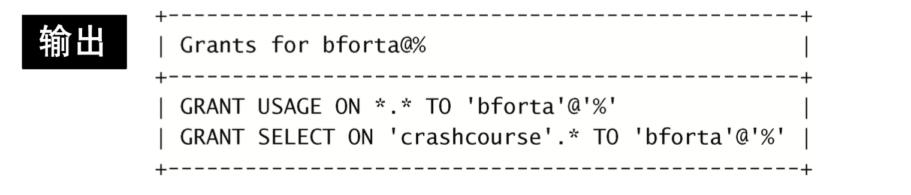

# MySQL用户管理

## 查询所有用户

MySQL用户账号和信息存储在名为mysql的MySQL数据库中。一般不需要直接访问mysql数据库和表，但有时需要 直接访问。需要直接访问它的时机之一是在需要获得所有用户账号列表时。

```mysql
USE MYSQL;
SELECT user FROM user;
# (列名是user 表明也是user)
```



mysql数据库有一个名为user的表，它包含所有用户账号。

user表有一个名为user的列，它存储用户登录名。

新安装的服务器可能只有一个用户(如这里所示)，过去建立的服务器可能具有很多用户。


## 创建用户账号

为了创建一个新用户账号，使用CREATE USER语句，如下所示:

```mysql
CREATE USER ben IDENTIFIED BY 'p@$$wOrd'
```

CREATE USER创建一个新用户账号。在创建用户账号时不一定需要口令，不过这个例子用IDENTIFIED BY 'p@$$wOrd'给出了一个口令。

**指定散列口令**

IDENTIFIEDBY指定的口令为纯文本，MySQL 将在保存到user表之前对其进行加密。为了作为散列值指定口 令，使用IDENTIFIED BY PASSWORD。

**使用GRANT或INSERT **

GRANT语句也可以创建用 户账号，但一般来说CREATE USER是最清楚和最简单的句子。 

此外，也可以通过直接插入行到user表来增加用户，**不过为安全起见，一般不建议这样做**。


## 重命名用户账号

为重新命名一个用户账号，使用RENAME USER语句，如下所示:
```mysql
RENAME USER ben TO tina;
```

## 删除用户账号

为了删除一个用户账号(以及相关的权限)，使用DROP USER语句
```mysql
DROP USER ben;
```

## 设置访问权限

在创建用户账号后，必须接着分配访问权限。新创建的用户账号没有访问权限。它们能登录MySQL，但不能看到数据，不能执行任何数据库操作。

为看到赋予用户账号的权限，使用SHOW GRANTS FOR
```mysql
SHOW GRANTS FOR ben;
```



输出结果显示用户bforta有一个权限USAGE ON \*.\*。

**USAGE表示根本没有权限**，所以，此结果表示在任意数据库和任意表上对任何东西没有权限。

**用户定义为user@host** MySQL的权限用用户名和主机名结合定义。如果不指定主机名，则使用默认的主机名%(授予用户访问权限而不管主机名)。

**为设置权限，使用GRANT语句。GRANT要求你至少给出以下信息:**

* 要授予的权限;
* 被授予访问权限的数据库或表;
* 用户名。

以下例子给出GRANT的用法:

```mysql
GRANT SELECT ON abc(数据库名字).* TO ben;
```

此GRANT允许用户在 abc.*(abc数据库上的所有表)上使用SELECT。

通过只授予SELECT访问权限，用户ben 对abc数据库中的所有数据具有只读访问权限。

**SHOW GRANTS反映这个更改:**

```mysql
SHOW GRANTS FOR ben;
```



每个GRANT添加(或更新)用户的一个权限。MySQL读取所有授权，并根据它们确定权限。

## 撤销权限

**GRANT的反操作为REVOKE**，用它来撤销特定的权限。下面举一个例子:

```mysql
REVOKE SELECT ON abc(数据库名字).* TO ben;
```

这条REVOKE语句取消刚赋予用户ben的SELECT访问权限。被撤销的访问权限必须存在，否则会出错。


## 权限

**GRANT和REVOKE可在几个层次上控制访问权限:**

* 整个服务器，使用GRANT ALL和REVOKE ALL;  整个数据库，使用ON database.*;
* 特定的表，使用ON database.table;
* 特定的列;
* 特定的存储过程。

权限表

| 权限                    | 说明                                                         |
| ----------------------- | ------------------------------------------------------------ |
| ALL                     | 除GRANT OPTION外的所有权限                                   |
| ALTER                   | 使用ALTER TABLE                                              |
| ALTER ROUTINE           | 使用ALTER PROCEDURE和DROP PROCEDURE                          |
| CREATE                  | 使用CREATE TABLE                                             |
| CREATE ROUTINE          | 使用CREATE PROCEDURE                                         |
| CREATE TEMPORARY TABLES | 使用CREATE TEMPORARY TABLE                                   |
| CREATE USER             | 使用CREATE USER、DROP USER、RENAME USER和REVOKE ALL PRIVILEGES |
| CREATE VIEW             | 使用CREATE VIEW                                              |
| DELETE                  | 使用DELETE                                                   |
| DROP                    | 使用DROP TABLE                                               |
| EXECUTE                 | 使用CALL和存储过程                                           |
| FILE                    | 使用SELECT INTO OUTFILE和LOAD DATA INFILE                    |
| GRANT OPTION            | 使用GRANT和REVOKE                                            |
| INDEX                   | 使用CREATE INDEX和DROP INDEX                                 |
| INSERT                  | 使用INSERT                                                   |
| LOCK TABLES             | 使用LOCK TABLES                                              |
| PROCESS                 | 使用SHOW FULL PROCESSLIST                                    |
| RELOAD                  | 使用FLUSH                                                    |
| REPLICATION CLIENT      | 服务器位置的访问                                             |
| REPLICATION SLAVE       | 由复制从属使用                                               |
| SELECT                  | 使用SELECT                                                   |
| SHOW DATABASES          | 使用SHOW DATABASES                                           |
| SHOW VIEW               | 使用SHOW CREATE VIEW                                         |
| SHUTDOWN                | 使用mysqladmin shutdown(用来关闭MySQL)                       |
| SUPER                   | 使用CHANGE MASTER、KILL、LOGS、PURGE、MASTER和SET GLOBAL。还允许mysqladmin调试登录 |
| UPDATE                  | 使用UPDATE                                                   |
| USAGE                   | 无访问权限                                                   |

使用GRANT和REVOKE，再结合表中列出的权限，你能对用户可以就你的宝贵数据做什么事情和不能做什么事情具有完全的控制。

**简化多次授权** ,可通过列出各权限并用逗号分隔，将多条 GRANT语句串在一起，如下所示:

```mysql
GRANT SELECT,INSERT ON DBName.* TO ben;
```

## 更改口令

为了更改用户口令，可使用SET PASSWORD语句。新口令必须如下加密:

```mysql
SET PASSWORD FOR ben = Password ('new Password');
```
SET PASSWORD更新用户口令。新口令必须传递到Password()函 数进行加密。

SET PASSWORD还可以用来设置你自己的口令:

```mysql
SET PASSWORD = Password ('new Password');
```

在不指定用户名时，SET PASSWORD更新当前登录用户的口令。

